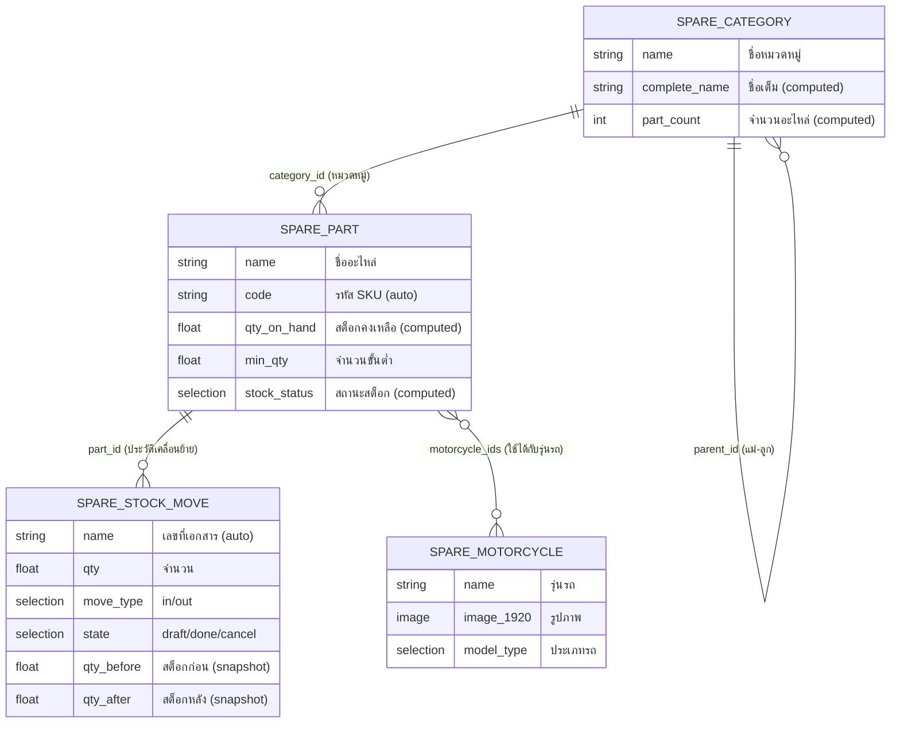

# 📖 อธิบายโค้ด Module Wearhousepart

เอกสารนี้อธิบายโค้ด Python ทั้ง 4 Model ของ module `wearhousepart`

---

## 📁 1. spare_part.py — โมเดลชิ้นส่วนอะไหล่

[spare_part.py](file:///c:/Users/autod/Desktop/inten/warehousepart/odoo/addons/wearhousepart/models/spare_part.py)

### 1.1 การประกาศ Class และ Meta

```python
class SparePart(models.Model):
    _name = 'spare.part'              # ชื่อ technical ของ model (ใช้อ้างอิงในระบบ Odoo)
    _description = 'ชิ้นส่วนอะไหล่'    # คำอธิบายที่แสดงใน UI
    _inherit = ['mail.thread', 'mail.activity.mixin']
    # ↑ สืบทอดจาก mail.thread → ทำให้มี Chatter (ประวัติข้อความ) ที่ form view
    #   และ mail.activity.mixin → ทำให้มีระบบ Activity (กำหนดงาน/นัดหมาย)
    _order = 'code'  # เรียงข้อมูลตาม field 'code' เป็นค่าเริ่มต้น
```

### 1.2 Fields (ฟิลด์ข้อมูล)

```python
name = fields.Char(string='ชื่ออะไหล่ (ไทย)', required=True, tracking=True)
# ↑ required=True  → ต้องกรอก ห้ามเว้นว่าง
#   tracking=True  → บันทึกประวัติการเปลี่ยนแปลงค่าใน Chatter

code = fields.Char(
    string='รหัสอะไหล่ (SKU)', required=True, copy=False,
    readonly=True, default=lambda self: _('New'), tracking=True)
# ↑ copy=False     → เวลา duplicate record จะไม่ copy ค่านี้ไปด้วย (สร้างรหัสใหม่)
#   readonly=True  → ผู้ใช้แก้ไขไม่ได้ (ระบบสร้างให้อัตโนมัติ)
#   default=lambda self: _('New')  → ค่าเริ่มต้นเป็น "New" (รอถูกแทนที่ตอน create)

category_id = fields.Many2one(
    'spare.category', string='หมวดหมู่',
    required=True, tracking=True, index=True)
# ↑ Many2one → เชื่อมไปหา model 'spare.category' (ความสัมพันธ์แบบ หลาย-ต่อ-หนึ่ง)
#   index=True → สร้าง database index เพื่อค้นหาเร็วขึ้น

motorcycle_ids = fields.Many2many(
    'spare.motorcycle', string='รุ่นรถที่ใช้ได้')
# ↑ Many2many → ความสัมพันธ์แบบ หลาย-ต่อ-หลาย
#   อะไหล่ 1 ชิ้นใช้ได้กับหลายรุ่นรถ, รถ 1 รุ่นใช้อะไหล่ได้หลายชิ้น

qty_on_hand = fields.Float(
    string='จำนวนในสต็อก', compute='_compute_qty_on_hand',
    store=True, digits=(12, 2))
# ↑ compute → ค่าคำนวณอัตโนมัติจาก method '_compute_qty_on_hand'
#   store=True → เก็บค่าลง database (ไม่ต้องคำนวณทุกครั้งที่อ่าน)
#   digits=(12, 2) → ความแม่นยำ: 12 หลัก, ทศนิยม 2 ตำแหน่ง

stock_status = fields.Selection([
    ('in_stock', 'มีสต็อก'),
    ('low_stock', 'สต็อกต่ำ'),
    ('out_of_stock', 'หมดสต็อก'),
], string='สถานะสต็อก', compute='_compute_stock_status', store=True)
# ↑ Selection → ให้เลือกได้จากตัวเลือกที่กำหนด
#   คำนวณอัตโนมัติจาก qty_on_hand กับ min_qty

stock_move_ids = fields.One2many(
    'spare.stock.move', 'part_id', string='ประวัติการเคลื่อนย้าย')
# ↑ One2many → ความสัมพันธ์แบบ หนึ่ง-ต่อ-หลาย (ด้านกลับของ Many2one)
#   อะไหล่ 1 ชิ้น มีประวัติเคลื่อนย้ายได้หลาย record
```

### 1.3 Method สร้างรหัสอัตโนมัติ (create)

```python
@api.model_create_multi          # decorator: ทำงานตอนสร้าง record ใหม่ (รองรับสร้างหลาย record พร้อมกัน)
def create(self, vals_list):
    for vals in vals_list:
        if vals.get('code', _('New')) == _('New'):
            # ถ้า code ยังเป็น 'New' → สร้างรหัสใหม่อัตโนมัติ

            # ดึงชื่อหมวดหมู่มาสร้าง prefix
            category = self.env['spare.category'].browse(vals.get('category_id'))
            prefix_map = {
                'เครื่องยนต์': 'ENG',    # Engine
                'กรอง/น้ำมัน': 'FLT',    # Filter
                'ระบบเบรก': 'BRK',       # Brake
                # ... อื่นๆ
            }
            prefix = prefix_map.get(category.name, 'SPR') if category else 'SPR'
            # ↑ ถ้าไม่เจอชื่อหมวดหมู่ใน map → ใช้ 'SPR' เป็น prefix เริ่มต้น

            seq = self.env['ir.sequence'].next_by_code('spare.part') or '0001'
            # ↑ ดึงเลขลำดับถัดไปจาก ir.sequence (เช่น 0001, 0002, ...)

            vals['code'] = '%s-%s' % (prefix, seq)
            # ↑ ผลลัพธ์เช่น: ENG-0001, BRK-0002, FLT-0003

    return super().create(vals_list)  # เรียก create ของ parent class เพื่อบันทึกจริง
```

### 1.4 Computed Fields (ฟิลด์คำนวณ)

```python
@api.depends('stock_move_ids', 'stock_move_ids.qty',
             'stock_move_ids.move_type', 'stock_move_ids.state')
# ↑ @api.depends → คำนวณใหม่เมื่อ field ใดใน depends เปลี่ยนแปลง
def _compute_qty_on_hand(self):
    for part in self:
        # กรองเฉพาะ move ที่ state='done' (ยืนยันแล้วเท่านั้น)
        moves = part.stock_move_ids.filtered(lambda m: m.state == 'done')

        # รวมจำนวนรับเข้า
        qty_in = sum(moves.filtered(lambda m: m.move_type == 'in').mapped('qty'))
        # รวมจำนวนเบิกออก
        qty_out = sum(moves.filtered(lambda m: m.move_type == 'out').mapped('qty'))

        # สต็อกคงเหลือ = รับเข้า - เบิกออก
        part.qty_on_hand = qty_in - qty_out
```

> [!IMPORTANT]
> `qty_on_hand` ไม่ได้เก็บค่าตรงๆ แต่ **คำนวณจากผลรวมของ stock move ทั้งหมดที่ยืนยันแล้ว** ดังนั้นถ้ายกเลิก move → state จะไม่ใช่ 'done' → ไม่ถูกนับในสูตรนี้

```python
@api.depends('qty_on_hand', 'min_qty')
def _compute_stock_status(self):
    for part in self:
        if part.qty_on_hand <= 0:
            part.stock_status = 'out_of_stock'    # หมดสต็อก
        elif part.qty_on_hand <= part.min_qty:
            part.stock_status = 'low_stock'       # สต็อกต่ำ (น้อยกว่าจำนวนขั้นต่ำ)
        else:
            part.stock_status = 'in_stock'         # มีสต็อกเพียงพอ
```

### 1.5 Action Button

```python
def action_view_moves(self):
    """เปิดหน้า list ประวัติเคลื่อนย้ายของอะไหล่ชิ้นนี้"""
    self.ensure_one()  # ต้องเลือก record เดียวเท่านั้น
    return {
        'type': 'ir.actions.act_window',       # เปิดหน้าต่างใหม่
        'name': 'ประวัติการเคลื่อนย้าย - %s' % self.name,
        'res_model': 'spare.stock.move',       # ไปแสดง model นี้
        'view_mode': 'tree,form',              # แสดงแบบ list กับ form
        'domain': [('part_id', '=', self.id)], # กรองเฉพาะ move ของอะไหล่ชิ้นนี้
        'context': {'default_part_id': self.id},
        # ↑ ตั้งค่าเริ่มต้นให้ part_id = อะไหล่ชิ้นนี้ เวลาสร้าง move ใหม่
    }
```

### 1.6 SQL Constraints

```python
_sql_constraints = [
    ('code_uniq', 'unique (code)', 'รหัสอะไหล่นี้มีอยู่แล้ว!'),
]
# ↑ บังคับในระดับ database ว่าค่า 'code' ต้องไม่ซ้ำกัน
```

---

## 📁 2. spare_stock_move.py — โมเดลการเคลื่อนย้ายสต็อก

[spare_stock_move.py](file:///c:/Users/autod/Desktop/inten/warehousepart/odoo/addons/wearhousepart/models/spare_stock_move.py)

### 2.1 Fields สำคัญ

```python
move_type = fields.Selection([
    ('in', 'รับเข้า'),     # เพิ่มสต็อก
    ('out', 'เบิกออก'),    # ลดสต็อก
], string='ประเภท', required=True, default='in', tracking=True)

state = fields.Selection([
    ('draft', 'ร่าง'),       # เอกสารร่าง ยังไม่มีผลต่อสต็อก
    ('done', 'เสร็จสิ้น'),    # ยืนยันแล้ว มีผลต่อสต็อก
    ('cancel', 'ยกเลิก'),    # ยกเลิกแล้ว ไม่มีผลต่อสต็อก
], string='สถานะ', default='draft', tracking=True)

qty_before = fields.Float(string='จำนวนก่อน', readonly=True)
# ↑ บันทึก snapshot สต็อกก่อนทำรายการ (readonly → ผู้ใช้แก้ไม่ได้)

qty_after = fields.Float(string='จำนวนหลัง', readonly=True)
# ↑ บันทึก snapshot สต็อกหลังทำรายการ

category_id = fields.Many2one(
    related='part_id.category_id', string='หมวดหมู่',
    store=True, readonly=True)
# ↑ related field → ดึงค่า category_id จาก part_id โดยอัตโนมัติ
#   store=True → เก็บลง DB ด้วย เพื่อให้ค้นหา/กรอง/เรียงได้เร็ว
```

### 2.2 สร้างเลขที่เอกสารอัตโนมัติ (create)

```python
@api.model_create_multi
def create(self, vals_list):
    for vals in vals_list:
        if vals.get('name', _('New')) == _('New'):
            move_type = vals.get('move_type', 'in')
            if move_type == 'in':
                # ใช้ sequence สำหรับรับเข้า เช่น WH-IN/00001
                vals['name'] = self.env['ir.sequence'].next_by_code(
                    'spare.stock.move.in') or _('New')
            else:
                # ใช้ sequence สำหรับเบิกออก เช่น WH-OUT/00001
                vals['name'] = self.env['ir.sequence'].next_by_code(
                    'spare.stock.move.out') or _('New')
    return super().create(vals_list)
```

### 2.3 ⭐ action_confirm — ยืนยันเอกสาร (สำคัญมาก)

```python
def action_confirm(self):
    for move in self:
        # ✅ ตรวจสอบ 1: ต้องเป็นสถานะ 'ร่าง' เท่านั้น
        if move.state != 'draft':
            raise UserError('สามารถยืนยันได้เฉพาะเอกสารที่อยู่ในสถานะร่างเท่านั้น')

        # ✅ ตรวจสอบ 2: จำนวนต้องมากกว่า 0
        if move.qty <= 0:
            raise ValidationError('จำนวนต้องมากกว่า 0')

        # 📸 บันทึกสต็อกก่อนทำรายการ
        move.qty_before = move.part_id.qty_on_hand

        # ✅ ตรวจสอบ 3: กรณีเบิกออก → ต้องมีของพอ
        if move.move_type == 'out':
            if move.qty > move.part_id.qty_on_hand:
                raise UserError('จำนวนเบิก (%s) มากกว่าสต็อกคงเหลือ (%s)')

        # 🔄 เปลี่ยนสถานะเป็น 'done'
        move.state = 'done'
        # ← ณ จุดนี้ Odoo จะ recompute qty_on_hand ของ spare.part โดยอัตโนมัติ
        #   เพราะ _compute_qty_on_hand depends กับ stock_move_ids.state

        # 📸 บันทึกสต็อกหลังทำรายการ
        move.qty_after = move.part_id.qty_on_hand

        # ⚠️ ถ้าสต็อกต่ำกว่าขั้นต่ำ → แจ้งเตือน
        if move.part_id.qty_on_hand <= move.part_id.min_qty:
            move._notify_low_stock()
```

> [!NOTE]
> **Flow การทำงานของ action_confirm:**
> 1. บันทึก `qty_before` = สต็อกปัจจุบัน
> 2. เปลี่ยน state เป็น `done` → Odoo recompute สต็อกใหม่ (บวก/ลบตาม move_type)
> 3. บันทึก `qty_after` = สต็อกหลัง recompute
> 4. ตรวจสอบและแจ้งเตือนถ้าสต็อกต่ำ

### 2.4 ⭐ action_cancel — ยกเลิกเอกสาร (แก้ไขล่าสุด)

```python
def action_cancel(self):
    for move in self:
        # ❌ ห้ามยกเลิกเอกสารที่ยืนยันแล้ว (state='done')
        if move.state == 'done':
            raise UserError('ไม่สามารถยกเลิกเอกสารที่ยืนยันแล้วได้')

        # 📸 บันทึกจำนวนก่อน/หลัง ณ ตอนยกเลิก
        current_stock = move.part_id.qty_on_hand
        move.qty_before = current_stock
        move.qty_after = current_stock
        # ↑ ก่อน/หลังเท่ากัน เพราะเอกสาร draft ไม่มีผลต่อสต็อก

        move.state = 'cancel'
```

> [!TIP]
> **ทำไม qty_before = qty_after ตอนยกเลิก?**
> เพราะเอกสารที่ยกเลิกได้ต้องเป็นสถานะ `draft` ซึ่ง **ยังไม่ส่งผลต่อสต็อก** ดังนั้นสต็อกก่อน/หลังจะเท่ากัน

### 2.5 action_draft — กลับเป็นร่าง

```python
def action_draft(self):
    for move in self:
        if move.state == 'cancel':
            move.state = 'draft'
        # ↑ เฉพาะเอกสารที่ถูกยกเลิก สามารถกลับมาเป็นร่างได้
```

### 2.6 แจ้งเตือนสต็อกต่ำ

```python
def _notify_low_stock(self):
    self.ensure_one()  # ตรวจสอบว่าเป็น record เดียว
    if self.part_id.qty_on_hand <= self.part_id.min_qty:
        # ส่งข้อความไปยัง Chatter ของอะไหล่
        self.part_id.message_post(
            body='⚠️ แจ้งเตือน: สต็อกต่ำ!...',
            message_type='notification',      # ประเภทข้อความ
            subtype_xmlid='mail.mt_note',     # ใช้ subtype "Note" (ไม่ส่ง email)
        )
```

---

## 📁 3. spare_category.py — โมเดลหมวดหมู่อะไหล่

[spare_category.py](file:///c:/Users/autod/Desktop/inten/warehousepart/odoo/addons/wearhousepart/models/spare_category.py)

### 3.1 รองรับโครงสร้างแบบ Tree (พ่อ-ลูก)

```python
_parent_name = 'parent_id'   # field ที่อ้างอิง parent
_parent_store = True          # เปิดใช้ parent_path → ค้นหา parent/child เร็วขึ้น
_rec_name = 'complete_name'   # ใช้ complete_name แสดงแทน name ตอนเลือก dropdown

parent_id = fields.Many2one('spare.category', string='หมวดหมู่หลัก',
    index=True, ondelete='cascade')
# ↑ ondelete='cascade' → ถ้าลบหมวดหมู่แม่ ลูกจะถูกลบตามไปด้วย

parent_path = fields.Char(index=True, unaccent=False)
# ↑ Odoo ใช้ field นี้เก็บ path เช่น "1/3/7/" เพื่อค้นหา hierarchy เร็ว

child_ids = fields.One2many('spare.category', 'parent_id', string='หมวดหมู่ย่อย')
# ↑ ด้านกลับของ parent_id → ดูว่ามีหมวดหมู่ย่อยอะไรบ้าง
```

### 3.2 ชื่อเต็ม (complete_name)

```python
@api.depends('name', 'parent_id.complete_name')
def _compute_complete_name(self):
    for category in self:
        if category.parent_id:
            # เช่น "เครื่องยนต์ / ลูกสูบ" (แม่ / ลูก)
            category.complete_name = '%s / %s' % (
                category.parent_id.complete_name, category.name)
        else:
            category.complete_name = category.name
# ↑ recursive=True ใน field definition ทำให้คำนวณซ้อนกันได้หลายระดับ
```

---

## 📁 4. spare_motorcycle.py — โมเดลรุ่นมอเตอร์ไซค์

[spare_motorcycle.py](file:///c:/Users/autod/Desktop/inten/warehousepart/odoo/addons/wearhousepart/models/spare_motorcycle.py)

### 4.1 Fields สำคัญ

```python
image_1920 = fields.Image(string='รูปภาพ', max_width=1920, max_height=1920)
# ↑ fields.Image → เก็บรูปภาพ และ resize อัตโนมัติไม่เกิน 1920x1920 px
#   Odoo จะสร้าง thumbnail ขนาดเล็กให้อัตโนมัติ (128, 256, 512 px)

model_type = fields.Selection([...], string='ประเภท')
# ↑ เช่น 'sport', 'commuter', 'automatic_scooter' ฯลฯ

part_ids = fields.Many2many('spare.part', string='อะไหล่ที่ใช้ได้')
# ↑ Many2many ด้านกลับ → รถ 1 รุ่นใช้อะไหล่ได้หลายชิ้น
```

---

## 🔄 แผนภาพความสัมพันธ์ระหว่าง Models



## 🔑 Concepts สำคัญที่ใช้ในโค้ด

| Concept | อธิบาย | ใช้ที่ไหน |
|---------|--------|-----------|
| `compute + store` | ค่าคำนวณอัตโนมัติ + เก็บลง DB | `qty_on_hand`, `stock_status`, `complete_name` |
| `@api.depends` | ระบุว่า compute field นี้ขึ้นอยู่กับ field อะไร → recompute เมื่อมีการเปลี่ยน | ทุก computed field |
| `tracking=True` | บันทึกประวัติการเปลี่ยนแปลงค่าใน Chatter | `name`, `code`, `price`, `state` ฯลฯ |
| `@api.model_create_multi` | Override method create เพื่อสร้างค่า auto (เช่นเลขรหัส) | `spare_part.create`, `spare_stock_move.create` |
| `ir.sequence` | ระบบเลขลำดับอัตโนมัติของ Odoo | สร้างรหัสอะไหล่, เลขที่เอกสาร |
| `related field` | ดึงค่าจาก model ที่เชื่อมโยง | `category_id` ใน stock_move ดึงจาก part_id |
| `One2many / Many2one` | ความสัมพันธ์ 1:N | category ↔ part, part ↔ stock_move |
| `Many2many` | ความสัมพันธ์ N:N | part ↔ motorcycle |
| `_parent_store` | เก็บ path ของ hierarchy เพื่อค้นหาเร็ว | spare.category |
| `message_post` | ส่งข้อความไปยัง Chatter | แจ้งเตือนสต็อกต่ำ |
